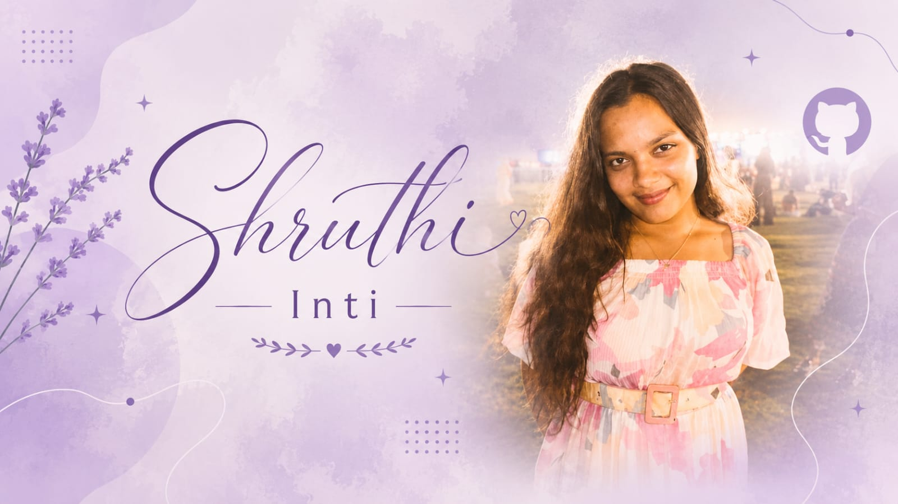

<!-- SHRUTHI INTI — GITHUB PROFILE README -->

  

 

  

  

## ✦ About Me

<table>
<tr>
<td align="center">

Electronics and Communication Engineering student building across  
**FPGA, Embedded Systems, Artificial Intelligence, Signal Processing and Full-Stack Development.**

I enjoy creating practical systems that combine engineering, software and thoughtful design.

  

</td>
</tr>
</table>

## ✦ Tech Stack

### Languages

### Development

### Tools

  

## ✦ Featured Projects

<table>
<tr>
<td width="50%" align="center" valign="top">

### 🎭 Moodify

AI-powered mood-based recommendation and interaction platform.

**Spring Boot · React · MySQL · Gemini API**

</td>
<td width="50%" align="center" valign="top">

### 🏛️ SevaSetu Telangana

Multilingual AI-assisted platform for government services.

**React · AI · OCR · Voice Assistance**

</td>
</tr>

<tr>
<td width="50%" align="center" valign="top">

### 🤖 Anusandhan

Privacy-focused offline AI companion.

**Python · Raspberry Pi · LLMs · Speech Recognition**

</td>
<td width="50%" align="center" valign="top">

### 🩸 FPGA CNN Accelerator

FPGA-based leukemia cell classification accelerator.

**Verilog · FPGA · CNN · RTL Design**

</td>
</tr>
</table>

## ✦ Selected Websites

<table>
<tr>
<td width="50%" align="center">

### 🏨 Aurelia Grand Hotel

</td>
<td width="50%" align="center">

### 💇 Anayaa Salon

</td>
</tr>

<tr>
<td width="50%" align="center">

### ☕ Aurum Cafe

</td>
<td width="50%" align="center">

### ✨ Elevate Studio

</td>
</tr>
</table>

## ✦ GitHub Analytics

 

## ✦ Contribution Activity

## ✦ Let's Connect

  

<img width="100%" src="https://capsule-render.vercel.app/api?
